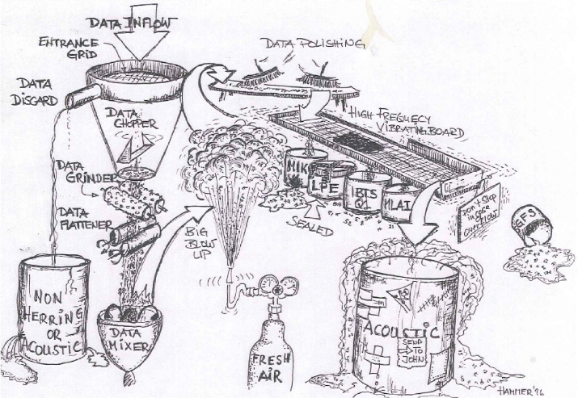

```{r setup, include=FALSE}
knitr::opts_chunk$set(echo = TRUE, message = FALSE, warning = FALSE)
```




# Preamble
___

The MSE evaluation by Höski is done in a framework were the historical assessment, short term predictions and long term simulation are done in the same framework (a separable model). First the historical assessment model is run, estimating biological parameters
and selection pattern of the fisheries with confidence intervals on parameters,
stock size and fishing mortality calculated from the inverse Hessian matrix. The
inverse Hessian matrix is then used as proposal distribution in MCMC simulations
where the number of simulations are 5 millions and the parameters from every
1000th run saved to a file. The saved sets of parameters are then used in 5000 stochastic
runs, in each run the assessment model is run, feeding directly into the prognosis,
observation model and Harvest Control rule, the latter being just a functions in the prognosis.

Upfront it was clear that the above framework could never mimic the historical dynamic estimates from the **sam** framework. The question was only how much would the difference be. Some limited comparison between the stock dynamics of **sam** vs **sep** has already been shown in a document on the sharepoint (Bjornsson_MSE_Initial.pdf). Here more details are added.

It might be added here that the estimates prior to 1999 are derived differently in **sam** and **sep**, in the former the cv on the catches is hardwired at some high value, in the latter a multiplier is estimated because of long hypothesized misreporting in this period.

```{r}
source("https://github.com/fishfollower/SAM/raw/master/stockassessment/R/tables.R")
source("R/functions/read_mac.R")
library(tidyverse)
library(cowplot)
theme_set(theme_gray())

load("ass/wkwide/fitAR-2.RData")
rbx1 <- fit %>% read_mac(path = "ass/wkwide", model = "sam")
rby1 <- rbx1$rby
rbx1$rbya <-
  rbx1$rbya %>%
  group_by(year) %>%
  mutate(sel = f/max(f)) %>%
  ungroup() %>%
  mutate(n2 = oC/sel,
         yc = stringr::str_sub(year, 3))
# Any process error in sam ssb estimates???
p <- 
  rbx1$rbya %>%
  mutate(ssb = n * exp(-((pF * f) + (pM * m))) * mat * sW) %>%
  group_by(year) %>%
  summarise(ssb2 = sum(ssb)) %>%
  full_join(rby1 %>% select(year, ssb)) %>%
  gather(variable, value, -year) %>%
  mutate(size = ifelse(variable == "ssb", 2, 4)) %>%
  ggplot(aes(year, value, colour = variable)) +
  geom_point(aes(size = size)) +
  geom_line(aes(lwd = 1/size)) +
  scale_colour_brewer(palette = "Set1")
# nope

pmort <- data_frame(age = 0:12,
                    pM = c(0, rep(0.316, 12)),
                    pF = c(0, 0.189, 0.189, 0.298, 0.298, 0.356, 0.356, 0.356, 0.356, 0.356, 0.356, 0.356, 0.356))

#rbx2 <-
#  fishvice::read_separ("/net/hafkaldi/export/u2/reikn/hoski/Mackerel/HCRSimulations/2periods",
#                       "HockeyEstAcf",
#                       run = "HockeyEstAcf",
#                       mName = "sep", Scale = 1e6)
#save(rbx2, file = "ass/husky/rbya_sep.rda")
load("ass/husky/rbya_sep.rda")
rbx2$rbya <- 
  rbx2$rbya %>% 
  as_tibble() %>% 
  mutate(cW = cW * 1e3,
         sW = sW * 1e3,
         ssbW = ssbW/1e3,
         dW = 0,
         lW = 0) %>% 
  filter(year <= 2016) %>% 
  left_join(pmort) %>% 
  dplyr::select(year:sW, mat, m, f, pM:dW, n, ssbW, z, f, pC:assYear,pF,pM) %>% 
  group_by(year) %>% 
  mutate(sel = f / f[age == 12]) %>% 
  ungroup()
rbx2$rby <-
  rbx2$rby %>%
  mutate(oY = oY / 1e3,
         pY = pY / 1e3,
         bio = bio/1e3,
         ssb = ssb/1e3) %>% 
  rename(rec = r) %>% 
  as_tibble() %>%
  filter(year <= 2016)
tsb <- rbx2$rbya %>% group_by(year) %>% summarise(tsb = sum(n * sW))
rbx2$rby <-
  rbx2$rby %>% 
  left_join(tsb)
```

# By year comparison
___

```{r}
x1 <- 
  rbx1$rby %>% 
  select(year, rec = r, ssb, tsb, fbar, model)
x2 <- 
  rbx2$rby %>%
  select(year, rec, ssb, tsb, fbar, model)
x1 %>% 
  bind_rows(x2) %>% 
  gather(variable, value, rec:fbar) %>% 
  ggplot(aes(year, value, colour = model)) +
  geom_line() +
  facet_wrap(~ variable, scale = "free_y") +
  scale_color_brewer(palette = "Set1") +
  labs(x = NULL, y = NULL) +
  theme(legend.position = c(0.1, 0.9))
rbx1$rbya %>% 
  select(year, age, sel, model) %>% 
  bind_rows(rbx2$rbya %>% select(year, age, sel, model)) %>% 
  ggplot(aes(year, sel, group = paste(age, model), colour = model)) +
  geom_line() +
  geom_text(aes(label = age)) +
  scale_color_brewer(palette = "Set1") +
  labs(x = NULL, y = "Selection pattern")
```

# Terminal years comparison
___

```{r}
rbx1$rbya %>%
  filter(year %in% 2015:2016) %>% 
  mutate(bio = n * sW,
         ssb = n * exp(-((pF * f) + (pM * m))) * sW * mat) %>% 
  select(year, age, n, f, sel, bio, ssb, model) %>% 
  bind_rows(rbx2$rbya %>%
              filter(year %in% 2015:2016) %>% 
              mutate(bio = n * sW,
                     ssb = n * exp(-((pF * f) + (pM * m))) * sW * mat) %>% 
              select(year, age, n, f, sel, bio, ssb, model)) %>% 
  gather(variable, value, n:ssb) %>% 
  ggplot(aes(age, value, colour = model)) +
  geom_point() +
  geom_line() +
  facet_grid(variable ~ year, scale = "free_y") +
  scale_colour_brewer(palette = "Set1") +
  labs(x = NULL, y = NULL) +
  theme(legend.position = c(0.9, 0.2)) +
  scale_x_continuous(breaks = 0:12)
```

# Some thoughts
___

I guess the issue that remains is what Martin succinctly described in comments at the webex 2017-07-31: "..., I wanted to leave some thoughts with you that I am happy to discuss with Hoski/Einar and/or Carmen. The most important is the overall objective of this exercise. We are asked to evaluate a proposed harvest rule given the outcomes of the benchmark assessment. And what we are doing is re-estimating the assessment with a different assessment model and using that as the basis of an MSE. This creates a potential conflict between the thing we are evaluating in an MSE and the thing we will be providing advice on on an annual basis. So as a minimum we should be evaluating the correspondence or differences between the SAM assessment and the basis of the MSE [Einar: provided above]. The risk is that we are carrying out an MSE on a stock assessment that bears no resemblance to the SAM assessment."

My guesstimate is that the answer to the question if the stock assessment used in the MSE bear resemblance or no resemblance to the **sam** benchmark assessment will not be unanimous among the mackerel people. The difference in the terminal years in stock in numbers and biomass is largely in the youngest age groups of which there is yet limited information. However the overall historical dynamics show substantial differences in key metrics. Here the main issue are the differences in the historical stock recruitment pairs that are carried forward into the future. It has been shown that the output from the two models when fed into the msy-machinery give similar estimates of $F_{msy}$ (see eq_sim_confronts_sam_and_sep.html on the sharepoint). Whether that alone constitutes enough of a "robustness test" to allow one to carry forward with the MSE-framework to answer the request is questionable.

# Addendums
___

One interesting comparison is to look at the estimated stock in numbers at age from the two assessments:

```{r}
rbx1$rbya %>% 
  select(year, age, n, model) %>% 
  bind_rows(rbx2$rbya %>% select(year, age, n, model)) %>% 
  ggplot(aes(year, n, colour = model)) +
  geom_point() +
  geom_line() +
  facet_wrap(~ age, scale = "free_y") +
  scale_color_brewer(palette = "Set1") +
  theme(legend.position = c(0.6, 0.1)) +
  labs(x = NULL, y = NULL, title = "Stock in numbers at age")
```

What we observed here, if we leave aside the difference in first years and possibly the terminal years, is that although the patterns in the younger age groups are substantially different the pattern in age groups that comprise the bulk of the catches (>= 75% of the catches in the last decade are from ages 4+) are in closer alignment. Another view of this is a scatter plot of the stock in numbers estimates of **sam** vs **sep** by age:

```{r, fig.height = 9}
x <-
  rbx1$rbya %>% 
  select(year, age, n, model) %>% 
  bind_rows(rbx2$rbya %>% select(year, age, n, model)) %>% 
  spread(model, n) %>% 
  mutate(yc = year - age,
         yc = stringr::str_sub(yc, 3))
x %>% 
  filter(year %in% 1990:2014) %>% 
  ggplot(aes(sam, sep)) +
  theme_bw() +
  geom_abline(colour = "grey") +
  geom_text(data = x, aes(label = yc), angle = 45, colour = "blue") +
  geom_point(colour = "red", size = 0.5) +
  geom_smooth(method = "lm", colour = "red") +
  facet_wrap(~ age, scale = "free") +
  labs(title = "Stock in numbers, fit (red colour) for years: 1990:2014", 
       subtitle = "Grey line: slope 1, intercept 0. Blue labels: yearclass (all years included)")
```

One additional view of this is looking at the difference in biomass estimates, starting from total biomass ($B_{0+}$) and up to biomass 8 years and older ($B_{8+}$):

```{r}
rbx1$rbya %>% 
  select(year, age, n, sW, model) %>% 
  bind_rows(rbx2$rbya %>% select(year, age, n, sW, model)) %>% 
  mutate(bio = n * sW) %>%
  arrange(desc(age)) %>% 
  group_by(year, model) %>%
  mutate(cbio = cumsum(bio)) %>% 
  ungroup() %>% 
  filter(age <= 8,
         year >= 1999) %>% 
  mutate(age = paste0(age, "+")) %>% 
  ggplot(aes(year, cbio, colour = model)) +
  geom_line() +
  facet_wrap(~ age, scale = "free_y") +
  labs(x = NULL, y = NULL,
       title = "Biomass estimates using different age cutoffs") +
  scale_color_brewer(palette = "Set1")
```

The difference in the younger age groups is largely a result of the process error being allowed to create havoc in those age groups, throwing fish in and/or out of each cohorts.

This latter point is something to think about with respect to the warranty of using the ssb vs. recruitment estimates at age 0 from sam in any simulations.

# On process error
___

The difference in the patterns observed in the sam vs sep model are in part because sam attempts to separate the error term into observation errors and process errors. One way to think about or visualize the process error is that it is deviation from the constant M assumption:

```{r}
rbya <- rbx1$rbya
rbya %>% 
  ggplot(aes(year, p.m)) +
  geom_text(aes(label = age)) +
  geom_smooth(span = 0.1) +
  labs(x= NULL, y = NULL,
       title = "Process error expressed as deviations in mortality",
       subtitle = "Numerical values represent age") +
  scale_x_continuous(breaks = seq(1980, 2015, by = 5), lim = c(1980, 2016))
```

In the above visualization positive can be though of as additional mortality on top of the constant M assumptions and negative values as lower mortality than the constant M. Of note here is that the process error is not random, i.e. we can have number of years where the "net process error" is negative or positive. The process error in Mackerel is one of the highest we have seen across stocks.

Another visualization of the process error can be made by expressing then as deviations in numbers:
```{r}
rbya %>% 
  filter(age < 12) %>% 
  ggplot(aes(year, p.n)) +
  geom_col() +
  facet_wrap(~ age, scale="free_y") +
  labs(x= NULL, y = NULL,
       title = "Process error expressed as deviations in numbers",
       subtitle = "Red points are the catch at age") +
  scale_x_continuous(breaks = seq(1980, 2015, by = 5), lim = c(1980, 2016)) +
  geom_point(data = rbya %>% filter(age < 12), aes(year, oC), col = "red", size = 0.25)
```

In the above graph the catch at age are superimposed just to get an idea of how much the deviations are relative to the only variable that is input to the model that has absolute units. The values here are the additions or subtractions of stock in numbers within a year that are not accounted for in the constant M assumption and that assigned to fishing mortality. Here positive values can be thought of as "immigration" and negative values as "emigration".
Again we observe the non randomness through time and within age groups. 

Of note is that in the mackerel assessment recruitment is defined at age 0. We observe however above that both in the defined recruitment age as well as in age groups when the mackerel recruiting to the fisheries one looses or gains additional recruitment. Hence, the recruitment pattern through time between lets say age group 0 and age group 3 differs substantially, the difference in the pattern only to some degree being associated with the temporal pattern in catches taken in age groups 0 to 2:

```{r}
d <- 
  rbya %>% 
  mutate(yc = year - age,
         n_and_c = n * exp(-m) + oC) %>% 
  filter(age < 3,
         yc %in% 1980:2013) %>% 
  group_by(yc) %>% 
  summarise(n_and_c = sum(n_and_c)) %>% 
  ungroup() %>% 
  mutate(n = n_and_c/mean(n_and_c))
rbya %>% 
  filter(age %in% c(0, 3)) %>% 
  mutate(yc = year - age) %>% 
  filter(yc %in% c(1980:2013)) %>% 
  select(age, yc, n) %>% 
  group_by(age) %>% 
  mutate(n = n/mean(n)) %>% 
  ggplot(aes(yc, n)) +
  geom_point(aes(colour = factor(age))) +
  geom_line(aes(colour = factor(age))) +
  #geom_line(data = d) +
  scale_color_brewer(palette = "Set1") +
  labs(title = "Recruitment pattern at age 0 vs age 3",
       x = "Year class",
       y = "Relative recruitment pattern",
       colour = "Age") +
  theme(legend.position = c(0.3, 0.8))
```

If one multiplies the deviation in stock in numbers with the catch weight at age and sums that mass value for each year one obtains this visualization:
```{r}
rby <- rbx1$rby
rbya %>% 
  group_by(year) %>% 
  summarise(p.b = sum(p.b, na.rm = TRUE)) %>% 
  ggplot(aes(year, p.b)) +
  geom_col() +
  geom_point(data = rby, aes(year, oY), col = "red") +
  labs(x= NULL, y = NULL,
       title = "Process error expressed as deviations in (netto) mass",
       subtitle = "Red points represent total yield") +
  scale_x_continuous(breaks = seq(1980, 2015, by = 5), lim = c(1980, 2016))
```

We observe here that in the years 2009 to 2012 a mass of some 250 kt was added annually to the stock (a total sum of some 1.1 mt). In year 2013 a mass close to 900 kt was added (a lot of it in older age groups), a value that is close to the yield in that year. If one runs the assessment as if the assessment year was 2014 (i.e. when the 2014 catches are not input into the model) one does not observe this process error in 2013. It is difficult to try to understand where sam picks up the signal that resutls large process error estimation in 2013, although some guestimates could be provided.

### Just for the record

Below are the package version used to generate the document:
```{r}
devtools::session_info()$packages %>% knitr::kable()
```

